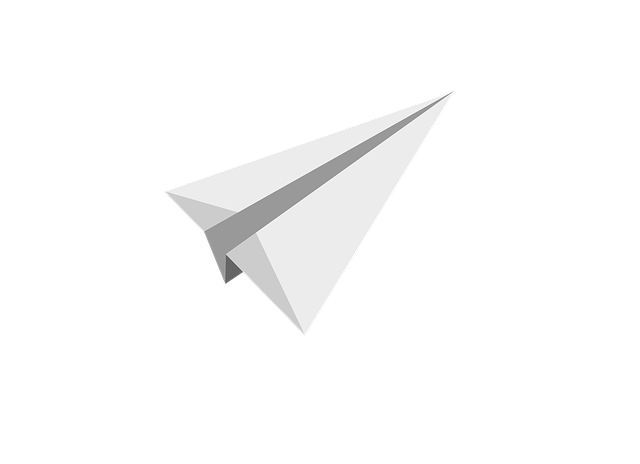

<!-- PROJECT SHIELDS -->

[![Contributors][contributors-shield]][contributors-url]
[![Forks][forks-shield]][forks-url]
[![Stargazers][stars-shield]][stars-url]
[![Issues][issues-shield]][issues-url]
[![MIT License][license-shield]][license-url]

<!-- PROJECT LOGO -->
 

  

<h1 align="center">Paper Plane</h1>

  

    OpenAPI based mock management system.
     
    <a href="todo...">View Demo</a>
    ·
    <a href="https://github.com/D1LL1G4F/Paper-Plane/issues">Report Bug</a>
    ·
    <a href="https://github.com/D1LL1G4F/Paper-Plane/issues">Request Feature</a>
  

<!-- ABOUT THE PROJECT -->

## About The Project

[![Product Name Screen Shot][product-screenshot]](https://example.com)

Paper Plane is a web application for creating and managing product mocks. The whole application in based
on Firebase platform. Paper Plane takes advantage of OpenAPI standard and uses it for generation and validation
of mocked API responses.

### Built With

- [Next.js](https://nextjs.org/)
- [React.js](https://reactjs.org/)
- [Orbit](https://orbit.kiwi/)
- [TypeScript](https://www.typescriptlang.org/)
- [Firebase](https://firebase.google.com/)
- [json-schema-faker](https://github.com/json-schema-faker/json-schema-faker)
- [react-hook-form](https://react-hook-form.com/)

<!-- GETTING STARTED -->

## Running Paper Plane Instance

1. **Setup Firebase ENV variables** - create `.env.local` based on `.env.local.example`
2. **Generate Firebase Admin SDK private key** - add `serviceAccountKey.json` to root folder with generate private key for Firebase Admin SDK access
3. todo...

### Prerequisites

todo...

## Usage

todo..

<!-- ROADMAP -->

## Roadmap

- [] Todo..
- [] Todo..

<!-- LICENSE -->

## License

Distributed under the MIT License. See `LICENSE.txt` for more information.

<!-- MARKDOWN LINKS & IMAGES -->
<!-- https://www.markdownguide.org/basic-syntax/#reference-style-links -->

[contributors-shield]: https://img.shields.io/github/contributors/D1LL1G4F/Paper-Plane.svg?style=for-the-badge
[contributors-url]: https://github.com/D1LL1G4F/Paper-Plane/graphs/contributors
[forks-shield]: https://img.shields.io/github/forks/D1LL1G4F/Paper-Plane.svg?style=for-the-badge
[forks-url]: https://github.com/D1LL1G4F/Paper-Plane/network/members
[stars-shield]: https://img.shields.io/github/stars/D1LL1G4F/Paper-Plane.svg?style=for-the-badge
[stars-url]: https://github.com/D1LL1G4F/Paper-Plane/stargazers
[issues-shield]: https://img.shields.io/github/issues/D1LL1G4F/Paper-Plane.svg?style=for-the-badge
[issues-url]: https://github.com/D1LL1G4F/Paper-Plane/issues
[license-shield]: https://img.shields.io/github/license/D1LL1G4F/Paper-Plane.svg?style=for-the-badge
[license-url]: https://github.com/D1LL1G4F/Paper-Plane/blob/master/LICENSE.txt
[product-screenshot]: https://user-images.githubusercontent.com/26377907/163712872-0764607d-398c-405f-b62e-0445d099153d.png
